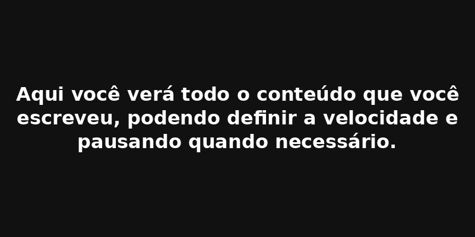

# Teleprompter Integrado
## Descrição
Este projeto é um teleprompter simples feito em HTML, CSS e JavaScript, que permite a leitura automática de textos com rolagem suave, ideal para gravação de vídeos, apresentações e entrevistas. O usuário pode iniciar, pausar e ajustar a velocidade da rolagem conforme desejar.

## 💡 Funcionalidades
Exibe texto com rolagem automática.

Controles para iniciar, pausar e ajustar a velocidade.

Interface limpa com fundo escuro para facilitar a leitura.

Abaixo um exemplo de como ele funciona na pratica;

